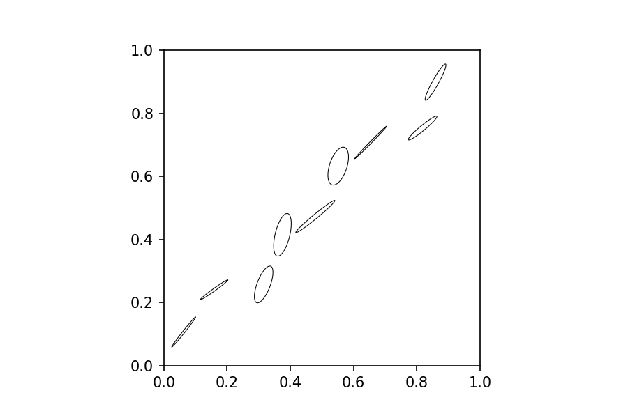

In order to graphically convey error corellation in the isotope data, error ellipses must be constructed from measured coordinates in isotope ratio space, the measurement error on each isotope ratio, and the associated error corellation. 
This code calculates the proper coordinates for the error ellipse (default 95% confidence interval). 
In addition, there is a function to calculate the 'best fit' distance to a fitted isochron, to evaluate the misfit of each data point. 

<!--more--> 

Get coordinates for error ellipses, based on coordinates
x-error, y-error (1 sigma) and error correllation, and scaling 
factor (defaults to 95% confidence).


```python
%matplotlib inline
```


```python
import numpy as np
import math
import matplotlib.pyplot as plt
import matplotlib as mpl
```

Calculate major and minor axes and inclination of ellipse.
returns x_size, y_size, theta.

```python
def calc_ellipse_params(x_err, y_err, rho, scale=2.4477):
    xy_err = rho * x_err * y_err
    covmat = np.matrix([[x_err**2,xy_err],
                        [xy_err, y_err**2]])

    eig = np.linalg.eigvals(covmat)

    theta  = 1/2 * math.atan((2*xy_err)/(x_err**2-y_err**2))
    x_size = eig[0]**0.5 * scale
    y_size = eig[1]**0.5 * scale
    if x_err >= y_err:
        theta = -theta
        
    return (x_size, y_size, theta)
```


```python
def ellipse_formula(x,y,a,b,theta):
    x_t = lambda t: x + a*math.cos(t)*math.cos(theta) - b*math.sin(t)*math.sin(theta)
    y_t = lambda t: y + b*math.sin(t)*math.cos(theta) - a*math.cos(t)*math.sin(theta)
    return lambda t:[x_t(t), y_t(t)]
```


```python
def ellipse(x,y,a,b,theta, num_pts=200):
    form = ellipse_formula(x,y,a,b,theta)
    return np.array([form(t) for t in np.linspace(0,2*math.pi- 2*math.pi/num_pts, num=num_pts)])
```

Ellipse formula generator, similar to error ellipse, but returns a function taking an angle
(positive rotation direction) in degrees and returns the edge coordinate in that direction.


```python
def error_ellipse_formula(x, y, x_err, y_err, rho, scale=2.4477):
    x_size, y_size, theta = calc_ellipse_params(x_err, y_err, rho, scale)

    return ellipse_formula(x,y,x_size,y_size,theta)
```

Takes data coordinates, 1 sigma errors, error correllation factor, scale
(95% conf default (2.4477), and number of edge points).
returns a coordinate matrix for for the error ellipse edges for each datapoint,
in data coordinates. 
This can be used for creating matplotlib patches.


```python
def error_ellipse(x, y, x_err, y_err, rho, scale=2.4477, num_points = 200):
    x_size, y_size, theta = calc_ellipse_params(x_err, y_err, rho, scale)
    
    return ellipse(x,y,x_size,y_size,theta,num_points)
```

# Example use

---

```python
fig, ax = plt.subplots(dpi=150)
rng = np.random.RandomState(1129412)
for i in range(1,10):
    x, y = i/10 + (rng.rand()-0.5)/10, i/10+(rng.rand()-0.5)/10
    x_err, y_err = 0.01+rng.rand()/50, 0.01+rng.rand()/50
    rho = 0.7*rng.rand() + 0.2
    e_coords = error_ellipse(x, y, x_err, y_err, rho)
    e = mpl.patches.Polygon(e_coords, fc='none', ec='k', lw=0.5, joinstyle='round')
    ax.add_patch(e)
ax.set_aspect('equal')
plt.savefig('output_12_0.png');
```


    

    

# Measuiring misfit

---

In order to evaluate a regression fit, we calculate the 'best fit' distance, defined as the shortest distance from an analysis point, in relation to the error ellipse size. This corresponds to the distance between the ellipse center and the first point on the line the ellipse touches under scaling.


```python
fig, ax = plt.subplots(dpi=150)
pts = [
    #x,   y,   x_err, y_err,  rho, scale
    [0.5, 0.3,  0.04,  0.06, 0.5, 0.5],
    [0.5, 0.3,  0.04,  0.06, 0.5, 1.8],
    [0.5, 0.3,  0.04,  0.06, 0.5, 3.6],
    [0.5, 0.3,  0.04,  0.06, 0.5, 6],
    
]
for pt in pts:
    e_coords = error_ellipse(*pt)
    e = mpl.patches.Polygon(e_coords, joinstyle='round', ls=':', fc='none', ec='C3', lw=1)
    ax.add_patch(e)

ax.plot([0.1,0.9], [0.2, 0.7]);
ax.annotate('', xy=(0.5,0.3), xytext=(0.59,0.51), xycoords='data', arrowprops={'arrowstyle': '|-|'})
ax.annotate('Best fit\ndistance', xy=(0.56,0.3), xycoords='data', fontsize=12)
ax.annotate('Regression line', xy=(0.17,0.3), c='k', xycoords='data', rotation =31, fontsize=12);
ax.set_aspect('equal')
plt.savefig('output_14_0.png');
```

    

    


```python
def get_bestfitdist(x, y, x_err, y_err, rho, fit):
    
    shift_vec = np.matrix([[0,fit.y0]])
    l0 = np.matrix([[1,fit.alpha]])
    
    coords = np.array([[x,y]]) - shift_vec

    a, b, theta = calc_ellipse_params(
        x_err, y_err, rho)
    
    ellipse_form = ellipse_formula(
        x,y,a,b,theta)
    
    scale_mx_1 = np.matrix([[1,0],[0,b/a]])
    scale_mx_2 = np.matrix([[1,0],[0,a/b]])

    rot_mx = lambda t: np.matrix([[np.cos(t), - np.sin(t)],
                                  [np.sin(t), np.cos(t)]])
    
    c_pp = (coords@ rot_mx(theta) @scale_mx_1).T
    l0_pp =  (l0@ rot_mx(theta) @scale_mx_1).T
    l0_alpha = l0_pp[1,0]/l0_pp[0,0]
    n_pp = np.matrix([[-l0_pp[1,0],l0_pp[0,0]]]).T
    n_alpha = n_pp[1,0]/n_pp[0,0]
    n_0 = c_pp[1,0] - c_pp[0,0]*n_alpha
    
    x_intercept = n_0 / (l0_alpha-n_alpha)
    c_adj_pp = np.matrix([[x_intercept,l0_alpha*x_intercept]])
    
    n = ((n_pp.T * scale_mx_2) * rot_mx(-theta)) + shift_vec
    n = n/np.linalg.norm(n)
    c = ((c_pp.T * scale_mx_2) * rot_mx(-theta)) + shift_vec
    c_adj = ((c_adj_pp * scale_mx_2) * rot_mx(-theta)) + shift_vec
    theta_n = np.arccos(n[0,0])
    ell_coords = ellipse_form(theta_n)
    dir_95_conf = np.linalg.norm(np.array(c)[0]- np.array(ell_coords)) 
    misfit = np.linalg.norm(c-c_adj) * (1 if c[0,0] >= c_adj[0,0] else -1) 
    return (c_adj, misfit, n, theta_n, dir_95_conf)
```


