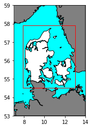
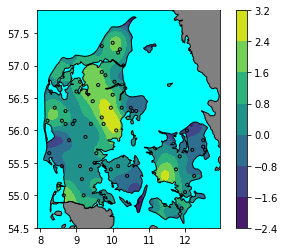
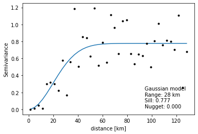
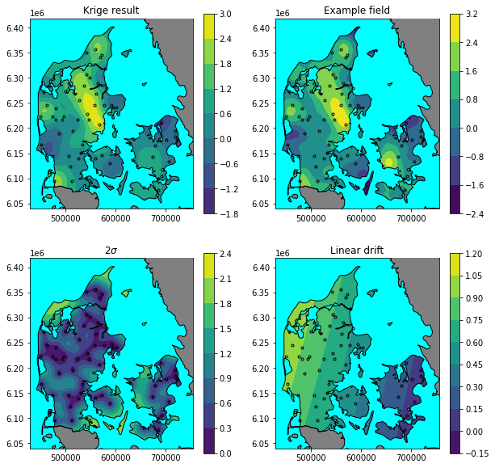
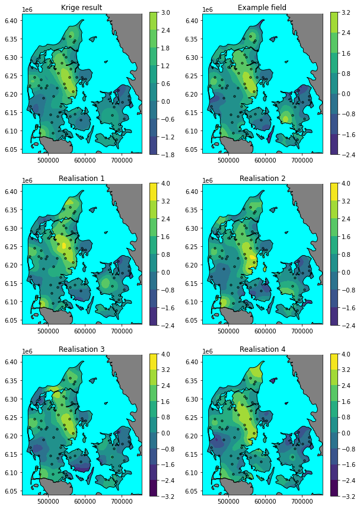

+++
title = "Kriging and map projection"
+++


An example of kriging and map projection in Python 3. Geopandas is used for reading and plotting data from shapefiles; pyproj for projecting data from geographic coortinates to UTM coordinates; the kriging solution from osgeo, gstools is used to fit the data, and generate conditioned fields; shapely is used to generate geometries; scipy.ndimage is used for vector-raster arithmetic; numpy for array manipulations; and matplotlib for ploting maps.

<!--more-->


[Imports are at the bottom of the page]()

### Map setup

Define projections: EPSG:4326 is the geographical reference (WGS-84), and the map is plotted in UTM zone 32N (EPSG:32632). 

```python
epsg_geog = 'EPSG:4326'
epsg_plot = 'EPSG:32632'
```

Define map boundaries.

```python
bounds = Polygon(((7,53),(7,59),(14,59),(14,53)))
bounds_gdf = gpd.GeoDataFrame(geometry=[bounds], crs=epsg_geog)
grid_bounds = Polygon(((7.9,54.5),(7.9,57.9),(13,57.9),(13,54.5)))
grid_bounds_gdf = gpd.GeoDataFrame(geometry=[grid_bounds], crs=epsg_geog)

```

Read basemap data and filter with map boundary.

```python
countries_gdf = gpd.read_file('../basemap/ne_10m_admin_0_countries/ne_10m_admin_0_countries.shp',
                              mask=bounds_gdf)
countries_gdf = gpd.clip(countries_gdf, bounds_gdf)
AOI_gdf = countries_gdf[countries_gdf['ADMIN'] == 'Denmark']
neighbours_gdf = countries_gdf[countries_gdf['ADMIN'] != 'Denmark']
sea_gdf = gpd.overlay(bounds_gdf, countries_gdf, how='difference')
```

It's tedious to replot the basemap for each map. Therefore its encapsulated in a function.

```python
def plot_basemap(ax, x, y, crs=epsg_geog):
    sea_gdf.to_crs(crs).plot(fc='aqua', ec='none', ax=ax, zorder=1)
    neighbours_gdf.to_crs(crs).plot(fc='gray', ec='k', ax=ax, zorder=3)
    AOI_gdf.to_crs(crs).plot(fc='none', ec='k', ax=ax, zorder=5)
    ax.set_xlim(x.min(), x.max())
    ax.set_ylim(y.min(), y.max())
```

Plot basemap data and grid boundary.

```python
fig, ax = plt.subplots()
plot_basemap(ax, np.array([7,14]),np.array([53,59]))
grid_bounds_gdf.plot(fc='none', ec='r', ax=ax, zorder=13)
```

    

    


### Generate example conditioned field

We generate a conditional field using a gaussian kernel with a functional range of 30 km, semivariance of 1, and a regional linear drift. The drift is added to the value as a multiple of the latitude and longitude.


```python
# structured field with a size 100x100 and a grid-size of 1x1
seed = 1259
grid_step = 0.05 # Degrees
lon0, lat0, lon1, lat1 = grid_bounds.bounds
lon = np.arange(lon0, lon1, grid_step)
lat = np.arange(lat0, lat1, grid_step)
model = gs.Gaussian(dim=2, var=1, len_scale=30/gs.EARTH_RADIUS, latlon=True)
srf = gs.SRF(
    model,
    seed=seed, 
    trend=lambda lon, lat: lon*0.01-lat*0.002,
)
srf((lat, lon), mesh_type='structured');
```

Generate meshgrid for projection at a later stage


```python
LON, LAT = np.meshgrid(srf.pos[1], srf.pos[0])
Z_true = srf.field
```

Now that we have the mesh grid we can create a mask for the AOI (Area Of Interest).


```python
mask = shpvec.contains(AOI_gdf.iloc[0].geometry, LON, LAT)
mask = np.equal(mask, False)
mask = ndimage.binary_erosion(mask, border_value=1, iterations=4)
```


In order to emulate real world sampling, we generate sampling points randomly inside the AOI. 
First a samples are generated with a uniform distribution within the grid boundary.


```python
n_pts = 150
np.random.seed(seed)
pts_lon = lon.min()+np.random.rand(n_pts)*(lon.max()-lon.min())
pts_lat = lat.min()+np.random.rand(n_pts)*(lat.max()-lat.min())
pts_gdf = gpd.GeoDataFrame(
    geometry=[Point(*xy) for xy in zip(pts_lon, pts_lat)], 
    crs=epsg_geog
)
``` 

Sampling locations are moved to the grid center, and value is sampled.

```python
pts_gdf['z'] = None
for i, pt in enumerate(pts_gdf.geometry):
    pt_lon, pt_lat = pt.coords[0]
    i_lon = np.abs(lon - pt_lon).argmin()
    i_lat = np.abs(lat - pt_lat).argmin()
    pts_gdf.loc[i,'geometry'] = Point(LON[i_lat, i_lon], LAT[i_lat, i_lon])
    pts_gdf.loc[i,'z'] = Z_true[i_lat, i_lon]
```

Samples lying at sea are filtered from the dataset.

```python
pts_gdf = gpd.overlay(pts_gdf, AOI_gdf, how='intersection')
pts_lon, pts_lat = [*zip(*[g.coords[0] for g in pts_gdf.geometry])]
pts_lon, pts_lat = np.array(pts_lon), np.array(pts_lat)
pts_z = np.array(pts_gdf['z'])
```

Plot the final sampling locations and the random field.

```python
fig, ax = plt.subplots()
cont = ax.contourf(LON, LAT, np.ma.masked_array(Z_true, mask), zorder=-30)
plt.colorbar(cont)
plot_basemap(ax, lon, lat)
pts_gdf.plot(marker='.', edgecolor='k', facecolor='none', ax=ax);
print(len(pts_gdf))
```


    


### Time to Krige

First we fit a the variogram. In this case we use the fitting routine built into the gstools module. We make sure to use spherical coordinates by setting `latlon = true`.
The `rescale = gs.EARTH_RADIUS` parameter rescales great circle distances to kilometers rather than the default: radians.

```python
bins = gs.standard_bins(
    (pts_lat, pts_lon),
    latlon=True,
    bin_no=40,
)
bin_c, vario = gs.vario_estimate((pts_lat, pts_lon), pts_z, bins, latlon=True)

model = gs.Gaussian(rescale=gs.EARTH_RADIUS, dim=2, latlon=True)
model.fit_variogram(bin_c, vario, nugget=True)[0];
```
Then we plot the semivariogram for a visual inspection.

```python
fig, ax = plt.subplots()
ax.plot(bin_c*model.rescale, model.variogram(bin_c))
ax.plot(bin_c*model.rescale, vario, '.k')
ax.set_xlabel('distance [km]')
ax.set_ylabel('Semivariance')
ax.annotate(
    text='{} model\nRange: {:0.0f} km\nSill: {:0.3f}\nNugget: {:0.3f}'.format(
        model.name,model.len_scale, model.sill, model.nugget),
    xy=(0.95,0.05),
    xycoords='axes fraction',
    ha='right', ma='left', va='bottom'
);
```



Having a suitable semivariogram we now proceed to fit the kriging model. Here we use universal kriging, to account for regional drift.

```python
def drift_lat(lat, lon):
    return lat
def drift_lon(lat, lon):
    return lon

uk = gs.krige.Universal(
    model=model,
    cond_pos=(pts_lat, pts_lon),
    cond_val=pts_z,
    drift_functions=[drift_lat, drift_lon],
    pseudo_inv=True,
)
```

Now the model fitted to the data, we can calculate expected values and variance.

```python
Z_fit, Z_v = uk((lat, lon), mesh_type="structured")
Z_mean = uk((lat, lon), mesh_type="structured", only_mean=True)
Z_se = (Z_v**0.5)
```


### Plot maps

Before plotting we setup the projection: UTM zone 32N.

```python
T = ppr.proj.Transformer.from_crs(crs_from=epsg_geog, crs_to=epsg_plot)

PR_X, PR_Y = T.transform(LAT, LON)
pts_x, pts_y = T.transform(pts_lat, pts_lon)
```

A color norm is used to synchronize colors across the maps, allowing easy comparison.

```python
norm = Normalize(
    np.min([srf.field, Z_fit]),
    np.max([srf.field, Z_fit])
)
```

And finally we can plot the maps.

```python
fig, axes = plt.subplots(2, 2, figsize=(10,10))

ax = axes[0,0]
plot_basemap(ax, PR_X, PR_Y, crs=epsg_plot)
cont = ax.contourf(PR_X, PR_Y, np.ma.masked_array(Z_fit, mask), norm=norm, zorder=0)
ax.plot(pts_x, pts_y, '.k', mfc='none', mew=1)
plt.colorbar(cont, ax=ax)
ax.set_title('Krige result')

ax = axes[0,1]
plot_basemap(ax, PR_X, PR_Y, crs=epsg_plot)
cont = ax.contourf(PR_X, PR_Y, np.ma.masked_array(srf.field, mask), norm=norm, zorder=0)
ax.plot(pts_x, pts_y, '.k', mfc='none', mew=1)
plt.colorbar(cont, ax=ax)
ax.set_title('Example field')


ax = axes[1,0]
plot_basemap(ax, PR_X, PR_Y, crs=epsg_plot)
cont = ax.contourf(PR_X, PR_Y, np.ma.masked_array(Z_se*2, mask), zorder=0)
ax.plot(pts_x, pts_y, '.k', mfc='none', mew=1)
plt.colorbar(cont, ax=ax)
ax.set_title('2$\sigma$')

ax = axes[1,1]
plot_basemap(ax, PR_X, PR_Y, crs=epsg_plot)
cont = ax.contourf(PR_X, PR_Y, np.ma.masked_array(Z_mean, mask), zorder=0)
ax.plot(pts_x, pts_y, '.k', mfc='none', mew=1)
plt.colorbar(cont, ax=ax)
ax.set_title('Linear drift');
```
    



### Plot realisations of the resulting random field

Following the same procedure as above we can plot realisations of the random field. First we generate conditioned surfaces using the universal kriging fit as the condition.

```python
realisations = []
for i in range(4):
    cond_srf = gs.CondSRF(uk)
    cond_srf((lat, lon), mesh_type="structured")
    realisations.append(cond_srf)
```


```python
norm = Normalize(
    min([*[r.field.min() for r in realisations], Z_fit.min(), srf.field.min()]),
    max([*[r.field.max() for r in realisations], Z_fit.max(), srf.field.max()]),
)
```


```python
fig, axes = plt.subplots(3, 2, figsize=(10,15))

ax = axes[0,0]
plot_basemap(ax, PR_X, PR_Y, crs=epsg_plot)
cont = ax.contourf(PR_X, PR_Y, np.ma.masked_array(Z_fit, mask), norm=norm, zorder=0)
ax.plot(pts_x, pts_y, '.k', mfc='none', mew=1)
plt.colorbar(cont, ax=ax)
ax.set_title('Krige result')

ax = axes[0,1]
plot_basemap(ax, PR_X, PR_Y, crs=epsg_plot)
cont = ax.contourf(PR_X, PR_Y, np.ma.masked_array(srf.field, mask), norm=norm, zorder=0)
ax.plot(pts_x, pts_y, '.k', mfc='none', mew=1)
plt.colorbar(cont, ax=ax)
ax.set_title('Example field')

for i in range(4):
    ax = axes[1 + (i//2), i%2]
    plot_basemap(ax, PR_X, PR_Y, crs=epsg_plot)
    cont = ax.contourf(PR_X, PR_Y, np.ma.masked_array(realisations[i].field, mask), norm=norm, zorder=0)
    ax.plot(pts_x, pts_y, '.k', mfc='none', mew=1)
    plt.colorbar(cont, ax=ax)
    ax.set_title(f'Realisation {i+1}')
```


    


<h3 id="imports">
Imports
</h3>

```python
%matplotlib inline

import numpy as np
import matplotlib.pyplot as plt
import geopandas as gpd
import gstools as gs
import pyproj as ppr

from copy import copy
from scipy import ndimage
from shapely.geometry import Polygon
from shapely.geometry import Point
import shapely.vectorized as shpvec
from matplotlib.colors import Normalize
```

[Top]()
